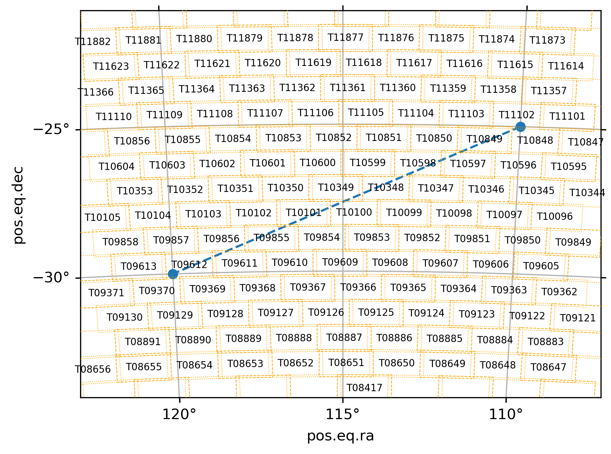
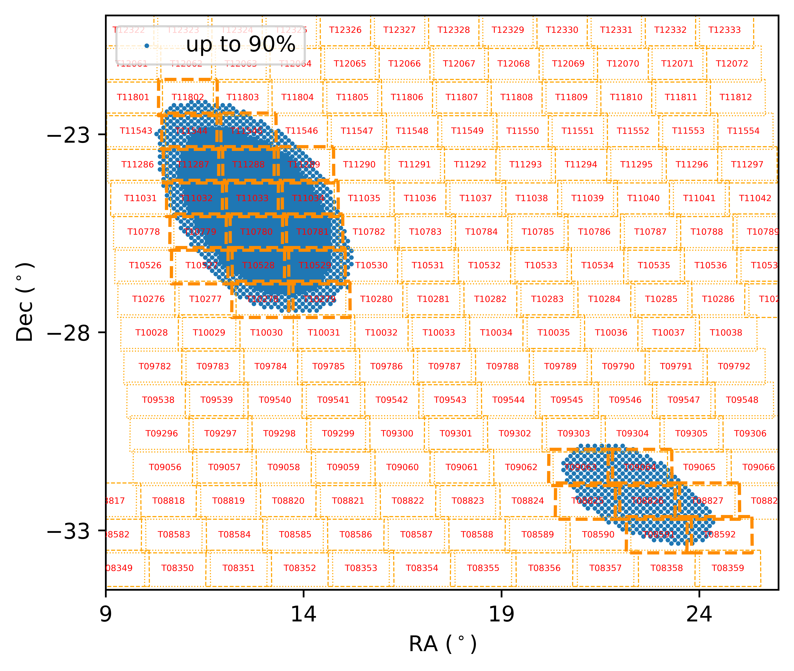

# dhutil
This is a collection of miscellaneous code snippets by Donghwan Hyun. 
The repository is public but primarily intended for team members of GWUniverse at SNU.


##  Install
* There is a version issue with astropy 7.0. install astropy <= 6.

Clone the repository

```bash
git clone https://github.com/renormalization2/dhutil.git
```

navigate into the cloned directory

```bash
cd dhutil/
```

and install it in editable mode.

```bash
pip install -e .
```

Now you can use it just like other packages. e.g.,
```
import matplotlib.pyplot as plt
from astropy.wcs import WCS
import dhutil as dh

# Define WCS Projection
wcs = WCS(naxis=2)
wcs.wcs.crval = [115, -27.0]  # Center of the projection in RA/Dec (degrees)
wcs.wcs.cdelt = [-0.01, 0.01]  # Pixel scale in degrees/pixel
wcs.wcs.crpix = [100, 100]  # Reference pixel (center of the plot)
wcs.wcs.ctype = ["RA---TAN", "DEC--TAN"]  # Gnomonic (tangent plane) projection

# Visualize 7DS Tiles with a one-liner!
fig, ax = plt.subplots(subplot_kw={"projection": wcs}, dpi=300)
ax.plot([110, 120], [-25, -30], "o--", transform=ax.get_transform("world"))
ax.coords[0].set_format_unit('deg')  # convert ra unit (hour to deg)
ax.grid()

dh.set_xylim(ax, 108, 123, -34, -21)  # optional
dh.overlay_tiles(color="k", fontsize=6.6)
```

<!--  -->

Also if you have the GW skymap path configured, try below!
```
import matplotlib.pyplot as plt
import dhutil as dh

dh.get_gw(190814, show=True)
plt.xlim(9, 26)
plt.ylim(-34.5, -20)
hltiles = {11802,
        11544, 11545, #11546,
        11287, 11288, 11289,
        11032, 11033, 11034,
        10779, 10780, 10781,
        10527, 10528, 10529,
        10278, 10279,
        9063, 9064,
        8825, 8826, 8827,
        8591, 8592}
dh.overlay_tiles(hltiles=hltiles, hltile_kw={"ls": "dashed"})
```

<!--  -->

## Setting Up Paths to Large Data

If you use this code on QSO, the SNU astronomy server, the absolute paths to the GW skymaps are already configured.
But you can always look into `gwloc.select_skymap` if you are in another environment or want to add other skymaps.

## Recommendations

Projected visualizations of a wide sky area can be made more convenient with `ligo.skymap`, which can be installed as follows.
Also refer to their official documentation: https://lscsoft.docs.ligo.org/ligo.skymap/quickstart/install.html
```
$ conda config --add channels conda-forge
$ conda config --set channel_priority strict
$ conda install ligo.skymap
```

